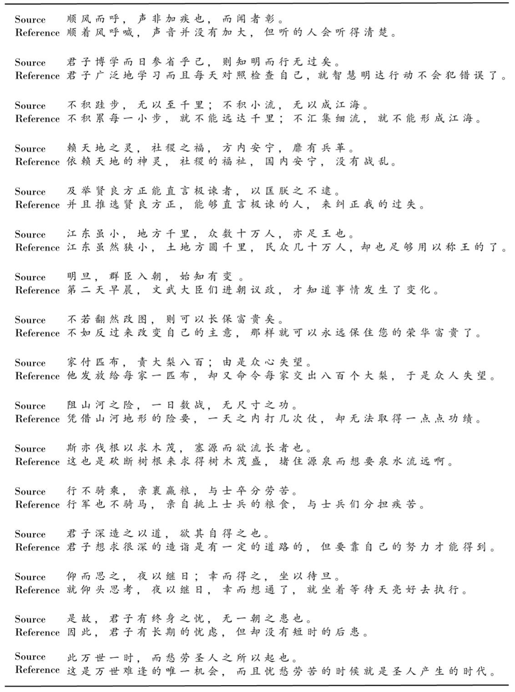

# Ancient-Modern Chinese Translation with a New Large Training Dataset

This repo contains the data of the following paper:
>**Ancient-Modern Chinese Translation with a New Large Training Dataset**. Dayiheng Liu, Kexin Yang, Qian Qu, Jiancheng Lv, TALLIP 2019 [[arXiv]](https://arxiv.org/abs/1808.03738)

# Overview

 

We create a new large-scale Ancient-Modern Chinese parallel corpus which contains **1.24M** bilingual pairs. To our best knowledge, this is the **first large high-quality Ancient-Modern Chinese dataset**.

# Dataset

Please scan the [completed agreement](https://github.com/dayihengliu/a2m_chineseNMT/blob/master/Ancient-Modern%20Chinese%20Parallel%20Dataset%20Release%20Agreement.pdf) and send it to losinuris[AT]gmail.com. A notification email will be sent to the email address and downloading of the Dataset will be authorized once the procedure is approved.

  
